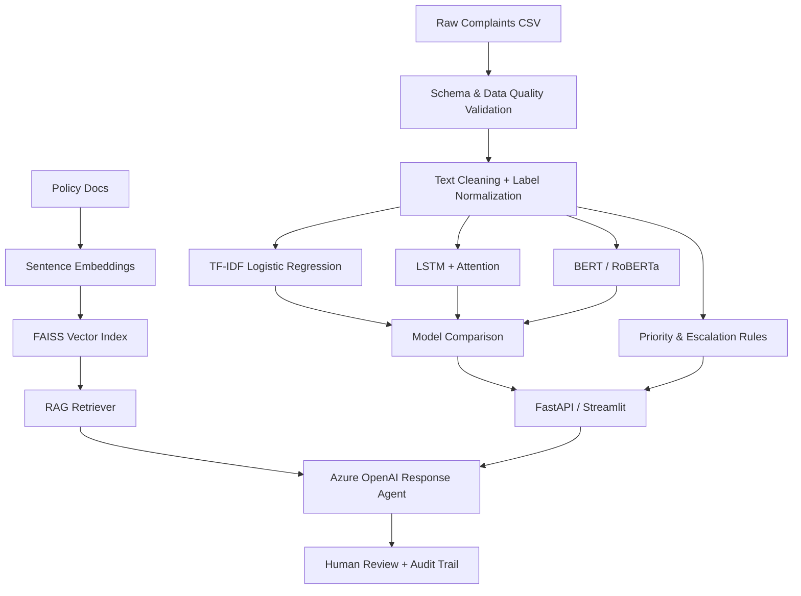

```mermaid
flowchart TD
    raw[Raw Complaints CSV] --> validate[Schema & Data Quality Validation]
    validate --> prep[Text Cleaning + Label Normalization]
    prep --> baseline[TF-IDF Logistic Regression]
    prep --> lstm[LSTM + Attention]
    prep --> bert[BERT / RoBERTa]
    baseline --> compare[Model Comparison]
    lstm --> compare
    bert --> compare
    prep --> risk[Priority & Escalation Rules]
    policies[Policy Docs] --> embed[Sentence Embeddings]
    embed --> faiss[FAISS Vector Index]
    faiss --> rag[RAG Retriever]
    compare --> serve[FastAPI / Streamlit]
    risk --> serve
    rag --> agent[Azure OpenAI Response Agent]
    serve --> agent
    agent --> audit[Human Review + Audit Trail]
```
